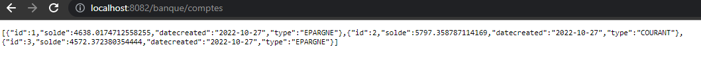
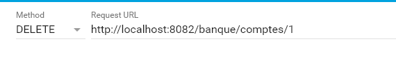

<h1>APP REST using JAX-RS JERSEY</h1>
<h3>Structure du projet</h3>

<h3>Compte Repo</h3>

<h3>Web Service JaxRs REST API</h3>

<h3>Configuration du servlet jersey</h3>

<h3>Get Comptes</h3>

<h3>Advenced Rest Client</h3>
<h5>GET</h5>

<h5>POST</h5>

<h5>PUT</h5>

<h5>DELETE</h5>

